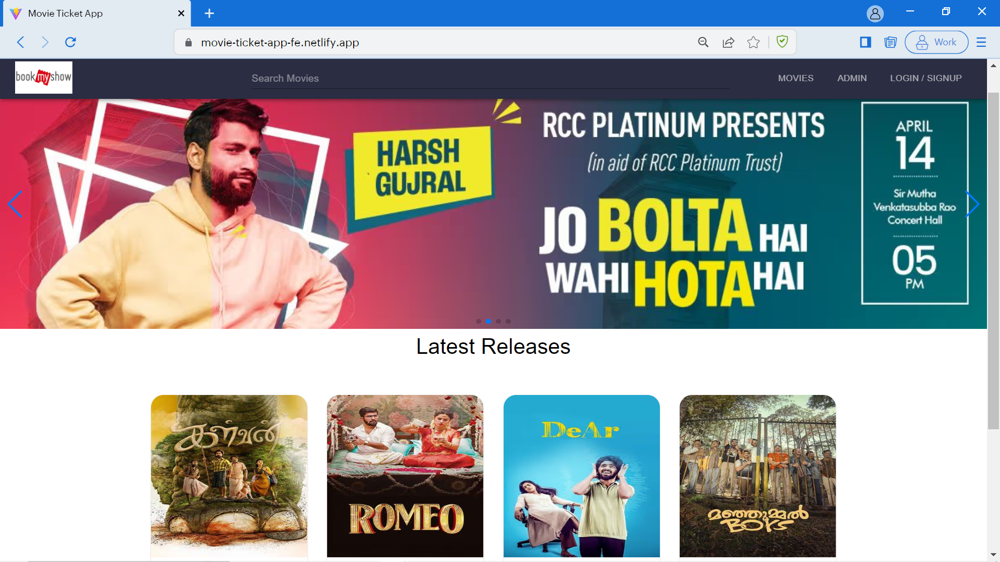
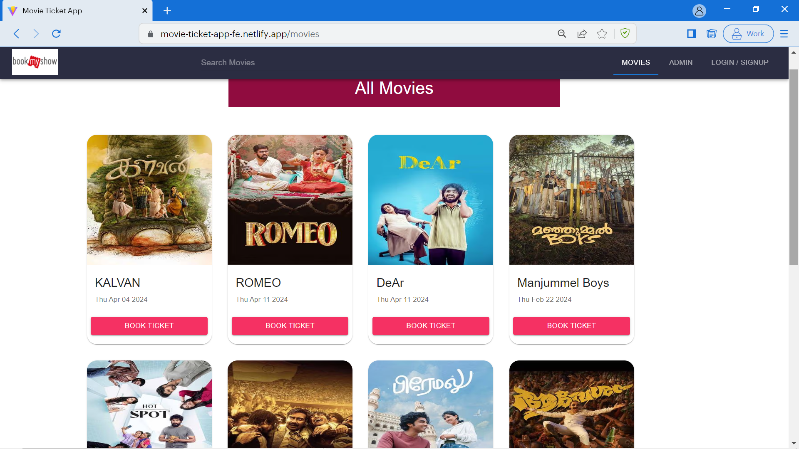

# MOVIE TICKET APPLICATION - MERN STACK

## Table of Contents
- [MOVIE TICKET APPLICATION - MERN STACK](#movie-ticket-application---mern-stack)
  - [Table of Contents](#table-of-contents)
  - [Project Description](#project-description)
  - [Features](#features)
  - [Installation](#installation)
  - [Usage](#usage)
  - [Technologies Used](#technologies-used)
  - [Contributing](#contributing)
  - [Contact Information](#contact-information)

## Project Description

**Full Stack Movie Ticket Booking App** is an advanced project that demonstrates the development of a robust and scalable online movie booking platform. It covers all the necessary steps and technologies required for building an efficient movie booking system using the MERN (MongoDB, Express, React, Node.js) stack. 

## Features

- User authentication with JWT
- Admin functionality for managing movies and bookings
- Seamless movie booking experience
- Advanced user roles and permissions
- Performance-optimized design
- And much more!

## Installation

Getting your development environment set up is fairly straightforward:

1. Clone the repository to your local machine.
2. Install Node.js and MongoDB if you haven't already.
3. Run `npm install` to install project dependencies.

## Usage

1. Start the Node.js server by running `npm start` in the server directory.
2. Start the React app by running `npm start` in the client directory.
3. Access the app in your browser at `http://localhost:5173`.

## Technologies Used

- MongoDB with Mongoose
- Node.js
- Express.js
- Password Encryption in MERN
- Admin Accounts
- JWT Authentication
- React.js
- Material UI
- Redux Toolkit
- Axios
- ES6

## Contributing

Contributions are welcome! If you'd like to contribute to this project.

## Contact Information

If you have any questions, feedback, or would like to get in touch, please reach out to:

- Senapathi Manoharan
- Email: manoharsena@gmail.com
- GitHub: https://github.com/manoharsena

